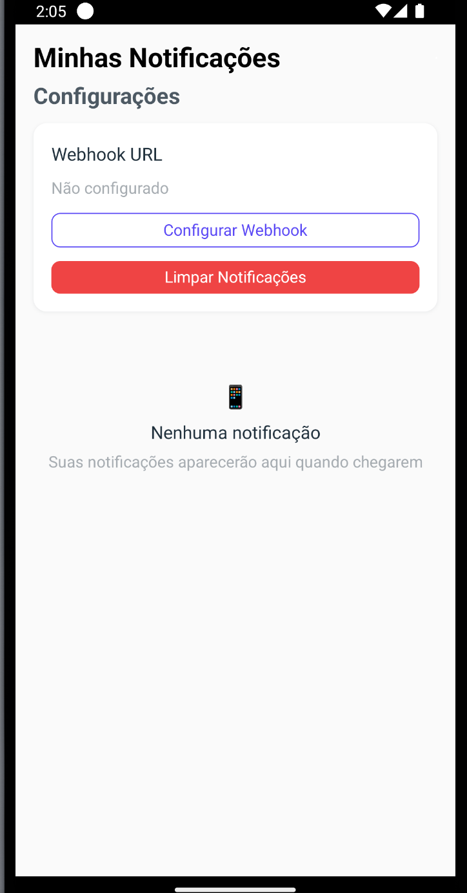
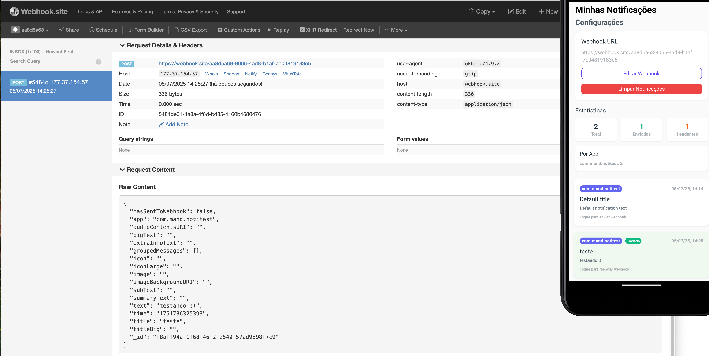
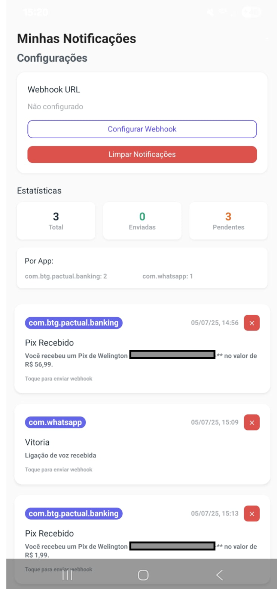

# 📱 Minhas Notificações

Um aplicativo React Native moderno para gerenciar e monitorar notificações do sistema, com suporte a webhooks e interface intuitiva.

## 🌟 Funcionalidades

- 📋 **Listagem de Notificações**: Visualize todas as notificações recebidas de forma organizada
- 🔗 **Webhooks Configuráveis**: Configure URLs de webhook para integração com sistemas externos
- 📊 **Estatísticas Visuais**: Acompanhe métricas das suas notificações
- 🎨 **Interface Moderna**: Design clean com React Native UI Lib
- ⚡ **Performance Otimizada**: Arquitetura com hooks customizados
- 🔄 **Pull to Refresh**: Atualize suas notificações com gesture nativo
- 🏷️ **Filtros por App**: Organize notificações por aplicativo de origem

## 📸 Screenshots

<div align="center" style="display: flex; flex-wrap: wrap; justify-content: center; gap: 20px;">
  
  
  
</div>

## 🚀 Tecnologias Utilizadas

- **React Native** 0.80.1
- **TypeScript** 5.0.4
- **React Native UI Lib** 7.44.0
- **React Native Navigation** 8.1.0
- **AsyncStorage** para persistência local
- **React Native Android Notification Listener** para captura de notificações

## 📋 Pré-requisitos

> **Nota**: Certifique-se de ter completado o [Guia de Configuração do Ambiente](https://reactnative.dev/docs/set-up-your-environment) antes de prosseguir.

- Node.js >= 18
- Yarn (recomendado)
- Android Studio

## 🛠 Instalação

1. **Clone o repositório**

   ```bash
   git clone https://github.com/thebylito/minhas-notificacoes.git
   cd minhas-notificacoes
   ```

2. **Instale as dependências**
   ```bash
   yarn install
   # ou
   npm install
   ```

## 🚀 Executando o Projeto

### Step 1: Inicie o Metro

Primeiro, você precisa executar o **Metro**, a ferramenta de build JavaScript do React Native.

Para iniciar o servidor de desenvolvimento do Metro, execute o seguinte comando da raiz do projeto:

```bash
# Usando npm
npm start

# OU usando Yarn
yarn start
```

### Step 2: Execute o aplicativo

Com o Metro executando, abra uma nova aba/janela do terminal da raiz do projeto e use o seguinte comando para construir e executar o app Android:

```bash
# Usando npm
npm run android

# OU usando Yarn
yarn android
```

Se tudo estiver configurado corretamente, você deve ver o app rodando no Emulador Android ou seu dispositivo conectado.

## 🔧 Configuração de Permissões

Para que o aplicativo funcione corretamente no Android, você precisa conceder a permissão de "Acesso às Notificações":

1. Abra **Configurações** do Android
2. Vá para **Apps** > **Minhas Notificações**
3. Toque em **Permissões**
4. Ative **Acesso às Notificações**

## 📝 Como Usar

1. **Configurar Webhook**: Na seção de configurações, adicione a URL do seu webhook
2. **Receber Notificações**: O app captura automaticamente as notificações do sistema
3. **Enviar para Webhook**: Toque em uma notificação para enviá-la ao webhook configurado
4. **Monitorar Estatísticas**: Acompanhe métricas na seção de estatísticas

## 🏗 Arquitetura

O projeto segue uma arquitetura moderna com:

- **Hooks Customizados**: `useNotifications` e `useAppConfig` para gerenciamento de estado
- **Componentes Reutilizáveis**: Cards, listas e formulários modulares
- **Repositórios**: Camada de persistência com AsyncStorage
- **Tipagem Forte**: TypeScript em todo o projeto

## 🎯 Próximos Passos

Agora que você executou com sucesso o app, algumas sugestões:

- **Personalize**: Modifique `src/App.tsx` e veja as mudanças em tempo real
- **Configure Webhooks**: Teste a integração com serviços externos
- **Explore Componentes**: Veja os componentes modulares em `src/components/`

### ⚡ Hot Reload

Quando você salvar arquivos, o app será atualizado automaticamente - isso é o poder do [Fast Refresh](https://reactnative.dev/docs/fast-refresh).

Para forçar um reload completo:

- **Android**: Pressione <kbd>R</kbd> duas vezes ou selecione **"Reload"** do **Dev Menu** (<kbd>Ctrl</kbd> + <kbd>M</kbd> no Windows/Linux ou <kbd>Cmd ⌘</kbd> + <kbd>M</kbd> no macOS)

## 🤝 Contribuindo

Contribuições são sempre bem-vindas! Sinta-se à vontade para:

1. Fazer fork do projeto
2. Criar uma branch para sua feature (`git checkout -b feature/AmazingFeature`)
3. Commit suas mudanças (`git commit -m 'Add some AmazingFeature'`)
4. Push para a branch (`git push origin feature/AmazingFeature`)
5. Abrir um Pull Request

## 📄 Licença

Este projeto está sob a licença MIT. Veja o arquivo `LICENSE` para mais detalhes.

## 🔧 Solução de Problemas

Se você está tendo problemas para executar os passos acima, consulte a página de [Troubleshooting](https://reactnative.dev/docs/troubleshooting) do React Native.

## 📚 Saiba Mais

Para aprender mais sobre React Native, confira os seguintes recursos:

- [Site do React Native](https://reactnative.dev) - aprenda mais sobre React Native
- [Primeiros Passos](https://reactnative.dev/docs/environment-setup) - uma **visão geral** do React Native e como configurar seu ambiente
- [Aprenda o Básico](https://reactnative.dev/docs/getting-started) - um **tour guiado** pelos **conceitos básicos** do React Native
- [Blog](https://reactnative.dev/blog) - leia os últimos posts oficiais do **Blog** do React Native
- [`@facebook/react-native`](https://github.com/facebook/react-native) - o repositório **GitHub** de código aberto do React Native

---

<div align="center">
  Feito com ❤️ por <a href="https://github.com/thebylito">@thebylito</a>
</div>
